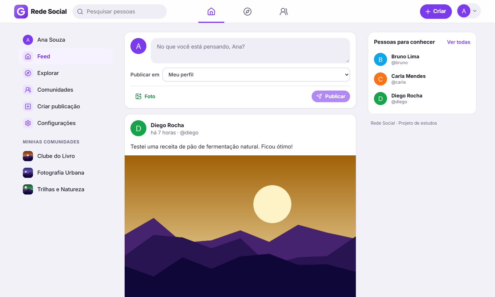
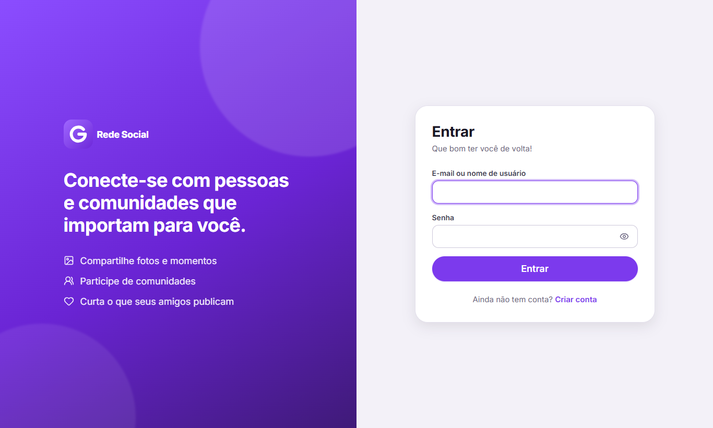
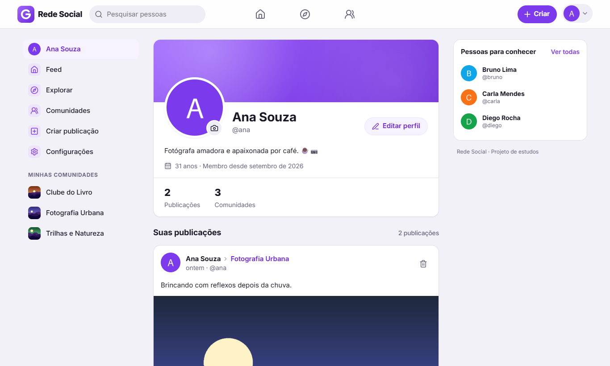
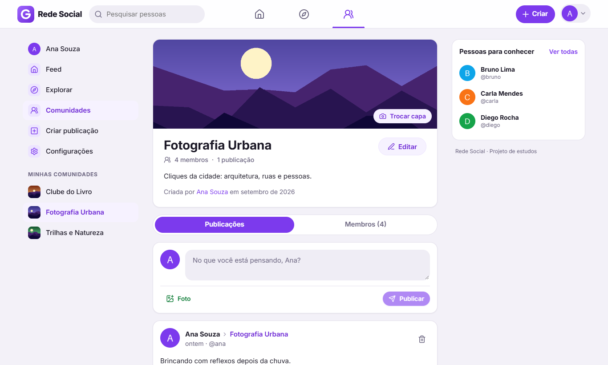
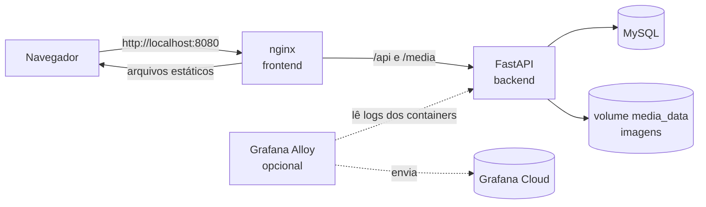
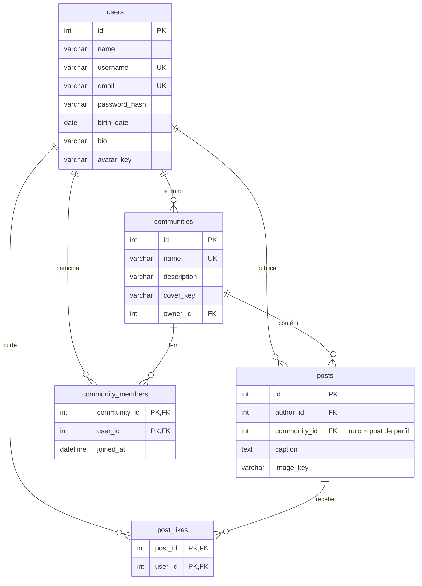

# Rede Social

Uma pequena rede social **funcional**, feita como laboratório de estudos de desenvolvimento
web full-stack. Usuários criam contas, mantêm perfis, publicam fotos com legenda, curtem
publicações e participam de comunidades.

O objetivo não é competir com redes sociais reais, e sim ter um **monólito bem estruturado**,
com código didático, testado e fácil de evoluir.



<details>
<summary>Mais telas</summary>

| Login | Perfil |
| --- | --- |
|  |  |

| Comunidade | Celular |
| --- | --- |
|  |  |

</details>

---

## Sumário

- [Funcionalidades](#funcionalidades)
- [Stack](#stack)
- [Arquitetura](#arquitetura)
- [Estrutura de diretórios](#estrutura-de-diretórios)
- [Como iniciar](#como-iniciar)
- [Como parar](#como-parar)
- [Variáveis de ambiente](#variáveis-de-ambiente)
- [Migrations](#migrations)
- [Testes](#testes)
- [Desenvolvimento com recarga automática](#desenvolvimento-com-recarga-automática)
- [API](#api)
- [Segurança](#segurança)
- [Observabilidade](#observabilidade)
- [Rede corporativa com proxy (certificados)](#rede-corporativa-com-proxy-certificados)
- [Solução de problemas](#solução-de-problemas)
- [Próximos passos sugeridos](#próximos-passos-sugeridos)

---

## Funcionalidades

- **Contas**: cadastro (nome, username, e-mail, senha, data de nascimento, bio e foto), login
  por e-mail **ou** username, logout e rotas protegidas.
- **Perfil**: foto, nome, @username, bio, idade, data de entrada, contagem de publicações e
  comunidades, e lista de publicações. Edição de dados, foto e senha em *Configurações*.
- **Explorar pessoas**: busca por nome ou username, com link para o perfil de cada pessoa.
- **Feed**: publicações de perfil de todos os usuários + publicações das comunidades das
  quais você participa, com paginação ("Carregar mais").
- **Publicações**: imagem e/ou legenda, no seu perfil ou em uma comunidade; curtir/descurtir,
  copiar link e excluir (autor ou dono da comunidade).
- **Comunidades**: criar (nome, descrição, capa opcional), buscar, filtrar "minhas",
  participar/sair, listar membros, publicar (somente membros). O dono edita nome,
  descrição e capa.
- **UX**: estados de carregamento (skeletons), mensagens de erro, notificações de sucesso,
  estados vazios, validação de formulários e layout responsivo (barra inferior no celular).

## Stack

| Camada | Tecnologias |
| --- | --- |
| Frontend | React 19, TypeScript, Vite, React Router, TanStack Query, react-hook-form + Zod, CSS Modules, lucide-react |
| Backend | Python 3.13, FastAPI, SQLAlchemy 2 (síncrono), Alembic, Pydantic v2, PyJWT, pwdlib (Argon2), Pillow |
| Banco | MySQL 8.4 |
| Infraestrutura | Docker, Docker Compose, nginx |
| Testes | pytest (backend, com MySQL real), Vitest + Testing Library (frontend) |
| Observabilidade (preparada) | Logs JSON estruturados, Grafana Alloy → Grafana Cloud (opcional) |

## Arquitetura



- **Monólito**: uma única API FastAPI e um único banco. Sem microserviços ou filas.
- **Mesma origem**: o nginx serve o React e repassa `/api` e `/media` para o backend. O
  navegador vê tudo como um único site, então não há CORS e o cookie de sessão funciona
  naturalmente.
- **Camadas no backend**: `routers` (HTTP) → `services` (regras de negócio) → `models`
  (SQLAlchemy). `schemas` (Pydantic) definem entrada e saída da API. Os services lançam
  erros de domínio (`app/core/exceptions.py`) que um handler converte em respostas HTTP.
- **Storage de arquivos abstraído**: o código usa a interface `Storage`
  (`app/storage/base.py`) e guarda no banco apenas a **chave** do arquivo
  (ex.: `posts/3f2a.webp`). Hoje a implementação é `LocalStorage` (disco/volume Docker);
  para usar S3/MinIO basta criar outra classe com `save`, `delete` e `url_for`.
- **Frontend em camadas**: `api/` (chamadas HTTP) → `hooks/` (TanStack Query: cache,
  loading, erros) → `pages/` e `components/`.

### Decisões técnicas

| Decisão | Motivo |
| --- | --- |
| JWT em **cookie httpOnly** (`SameSite=Lax`) | O JavaScript da página não consegue ler o token (protege contra XSS). A API também aceita `Authorization: Bearer` para o Swagger e scripts. |
| SQLAlchemy **síncrono** | Mais simples de entender. O FastAPI executa rotas síncronas em um pool de threads. |
| Tabela `communities` (e não `groups`) | `GROUPS` é palavra reservada no MySQL 8. |
| Uma imagem por post (coluna `image_key`) | Evita uma tabela extra agora. Várias imagens por post → criar `post_images`. |
| Guardar **data de nascimento** (não idade) | A idade muda com o tempo; ela é calculada. O perfil público mostra só a idade; e-mail e data completa são privados. |
| Paginação por **cursor** nos feeds e por **offset** nas listas | Em feeds, o cursor não repete nem pula posts quando novos são publicados. Listas por nome usam offset, que é mais simples. |
| Imagens **regravadas** pelo servidor | Confirma que o arquivo é mesmo uma imagem, reduz o tamanho e remove metadados (EXIF/GPS). |
| Curtidas | "Ações básicas" do post funcionam de verdade, em vez de botões falsos. |
| Migrations rodam ao iniciar o backend | O banco fica pronto sem passos manuais (`RUN_MIGRATIONS=true`). |

### Modelo de dados



Todas as tabelas têm `created_at`/`updated_at` em UTC (exceto as de ligação, que guardam
só a data de criação). Existe uma constraint `CHECK` que impede posts sem imagem **e** sem
legenda, e índices compostos `(author_id, id)` e `(community_id, id)` para as listagens.

## Estrutura de diretórios

```text
rede-social/
├── docker-compose.yml          # mysql + backend + frontend (+ alloy opcional)
├── docker-compose.dev.yml      # sobrescrita para desenvolvimento (hot reload da API)
├── .env.example                # modelo de configuração
├── backend/
│   ├── Dockerfile
│   ├── requirements.txt / requirements-dev.txt
│   ├── alembic/                # migrations
│   ├── scripts/docker-entrypoint.sh
│   ├── app/
│   │   ├── main.py             # cria a aplicação FastAPI
│   │   ├── seed.py             # dados de demonstração
│   │   ├── core/               # configuração, segurança (hash/JWT), erros, limite de upload
│   │   ├── db/                 # engine, sessão, base declarativa
│   │   ├── models/             # tabelas (SQLAlchemy)
│   │   ├── schemas/            # entrada/saída da API (Pydantic)
│   │   ├── services/           # regras de negócio (usuários, posts, comunidades, imagens)
│   │   ├── storage/            # abstração de armazenamento de arquivos
│   │   ├── api/                # dependências e routers HTTP
│   │   └── observability/      # logs JSON, request id, log de acesso
│   └── tests/                  # pytest
├── frontend/
│   ├── Dockerfile              # build com Node + nginx
│   ├── nginx/                  # configuração do nginx (proxy, cache, headers de segurança)
│   └── src/
│       ├── api/                # cliente HTTP e funções por recurso
│       ├── hooks/              # TanStack Query e hooks utilitários
│       ├── context/            # autenticação e notificações (toasts)
│       ├── components/         # ui/, layout/, posts/, communities/, users/, brand/
│       ├── pages/              # uma página por rota
│       ├── routes/             # rotas e proteção de acesso
│       ├── lib/                # formatação, validação (Zod), formulários
│       ├── styles/             # design tokens e estilos globais
│       └── test/               # utilitários de teste
├── infrastructure/
│   ├── mysql/init/             # cria o banco de testes na primeira inicialização
│   ├── alloy/config.alloy      # coletor de telemetria (opcional)
│   └── certs/                  # certificados extras para proxy corporativo (opcional)
└── docs/screenshots/
```

## Como iniciar

**Pré-requisitos:** Docker com Docker Compose v2. (Node.js 22+ só é necessário para rodar o
frontend fora do Docker ou os testes do frontend.)

```bash
cd rede-social
cp .env.example .env          # opcional: sem .env, os mesmos valores padrão são usados
docker compose up -d --build
```

Na primeira execução o build leva alguns minutos. Acompanhe com `docker compose ps` até os
três serviços ficarem `healthy`.

| Serviço | URL |
| --- | --- |
| Aplicação | http://localhost:8080 |
| Documentação da API (Swagger) | http://localhost:8080/api/docs (ou http://localhost:8000/api/docs) |
| Documentação da API (ReDoc) | http://localhost:8080/api/redoc |
| Health check | http://localhost:8080/api/health e `/api/health/ready` |
| MySQL | `localhost:3306` (usuário `rede_social` / senha `rede_social_dev_password`) |

### Credenciais de desenvolvimento

Com `SEED_DEMO_DATA=true` (padrão), a primeira inicialização cria usuários, comunidades e
publicações de demonstração. **Todos usam a senha `senha123`:**

| Usuário | E-mail |
| --- | --- |
| `ana` | ana@example.com |
| `bruno` | bruno@example.com |
| `carla` | carla@example.com |
| `diego` | diego@example.com |

Esses dados são apenas para desenvolvimento: o seed é ignorado quando `ENVIRONMENT=production`.
Para rodar o seed manualmente: `docker compose exec backend python -m app.seed`.

## Como parar

```bash
docker compose stop            # para os containers (mantém tudo)
docker compose down            # remove os containers (dados continuam nos volumes)
docker compose down -v         # remove também os volumes: APAGA banco e imagens enviadas
```

## Variáveis de ambiente

Todas têm valor padrão de desenvolvimento no `docker-compose.yml`. Para mudar, copie
`.env.example` para `.env`. O `.env` está no `.gitignore`: **nunca versione segredos reais**.

| Variável | Padrão | Descrição |
| --- | --- | --- |
| `ENVIRONMENT` | `development` | `development`, `test` ou `production`. Em produção a API recusa valores de desenvolvimento. |
| `FRONTEND_PORT` / `BACKEND_PORT` / `MYSQL_PORT` | `8080` / `8000` / `3306` | Portas expostas no host. |
| `MYSQL_DATABASE` / `MYSQL_USER` / `MYSQL_PASSWORD` / `MYSQL_ROOT_PASSWORD` | ver `.env.example` | Credenciais do MySQL (a API recebe como `DB_*`). |
| `SECRET_KEY` | chave de desenvolvimento | Assina os tokens JWT. Gere uma com `python -c "import secrets; print(secrets.token_urlsafe(48))"`. |
| `ACCESS_TOKEN_EXPIRE_MINUTES` | `1440` | Validade da sessão (minutos). |
| `COOKIE_SECURE` | `false` | `true` exige HTTPS para enviar o cookie (obrigatório em produção). |
| `CORS_ORIGINS` | vazio | Origens extras permitidas, separadas por vírgula (não é necessário com o nginx). |
| `MAX_UPLOAD_SIZE_MB` | `5` | Tamanho máximo de cada imagem. |
| `LOG_LEVEL` / `LOG_FORMAT` | `INFO` / `json` | Nível e formato dos logs (`json` ou `text`). |
| `SEED_DEMO_DATA` | `true` | Cria os dados de demonstração na inicialização (idempotente). |
| `ALLOY_UI_PORT` | `12346` | Porta da interface do Grafana Alloy (perfil `observability`). |
| `GRAFANA_CLOUD_*` | vazio | Credenciais do Grafana Cloud (veja [Observabilidade](#observabilidade)). |

## Migrations

As migrations ficam em `backend/alembic/versions/` e são aplicadas **automaticamente** quando o
container do backend inicia (`alembic upgrade head` no entrypoint).

```bash
# aplicar manualmente
docker compose exec backend alembic upgrade head

# ver a versão atual e o histórico
docker compose exec backend alembic current
docker compose exec backend alembic history

# criar uma nova migration após alterar os models (gera o arquivo no seu código local)
docker compose run --rm --no-deps -v "$(pwd)/backend:/app" --entrypoint alembic \
  backend revision --autogenerate -m "descricao da mudanca"
```

Sempre revise o arquivo gerado antes de aplicar. No Windows (PowerShell), troque
`$(pwd)/backend` por `${PWD}/backend`.

## Testes

**Backend** (pytest, contra um banco MySQL de testes real, `rede_social_test`, criado
automaticamente). O schema é criado pelas próprias migrations, então os testes também
validam o `upgrade`/`downgrade`:

```bash
docker compose exec backend pytest            # usa o código copiado na imagem
docker compose exec backend ruff check .      # lint

# rodando com o código local (sem rebuild), útil durante o desenvolvimento:
docker compose run --rm --no-deps -v "$(pwd)/backend:/app" --entrypoint pytest backend
```

Cobrem cadastro, login, autenticação (cookie, Bearer, token expirado), perfis, uploads
(formato, tamanho, EXIF, "decompression bomb"), posts, feed, curtidas, permissões,
comunidades e configuração de produção.

**Frontend** (Vitest + Testing Library):

```bash
cd frontend
npm install
npm test            # testes
npm run typecheck   # TypeScript
npm run lint        # oxlint
npm run build       # build de produção
```

## Desenvolvimento com recarga automática

```bash
# API recarrega ao salvar arquivos .py (código montado do host)
docker compose -f docker-compose.yml -f docker-compose.dev.yml up -d --build

# Frontend com hot reload (fora do Docker) em http://localhost:5173
cd frontend && npm install && npm run dev
```

O Vite repassa `/api` e `/media` para `http://localhost:8000`, imitando o nginx.

## API

Documentação interativa em **/api/docs**. Para testar rotas protegidas no Swagger, use
`POST /api/auth/login` (o navegador guarda o cookie) ou o botão **Authorize** (token Bearer).

| Recurso | Endpoints |
| --- | --- |
| Autenticação | `POST /api/auth/register`, `POST /api/auth/login`, `POST /api/auth/logout`, `POST /api/auth/token` |
| Usuário logado | `GET/PATCH /api/users/me`, `PUT /api/users/me/password`, `PUT/DELETE /api/users/me/avatar` |
| Usuários | `GET /api/users?q=`, `GET /api/users/{username}`, `GET /api/users/{username}/posts` |
| Posts | `GET /api/posts/feed`, `POST /api/posts` (multipart), `GET/DELETE /api/posts/{id}`, `PUT/DELETE /api/posts/{id}/like` |
| Comunidades | `GET/POST /api/communities`, `GET/PATCH /api/communities/{id}`, `PUT /api/communities/{id}/cover`, `PUT/DELETE /api/communities/{id}/membership`, `GET /api/communities/{id}/members`, `GET /api/communities/{id}/posts` |
| Saúde | `GET /api/health`, `GET /api/health/ready` |

Formato de erro: `{"detail": "mensagem", "errors": [{"field": "email", "message": "..."}]}`
(`errors` aparece quando o problema é de um campo específico).

## Segurança

Implementado:

- Senhas com hash **Argon2** (pwdlib); nunca em texto puro e nunca devolvidas pela API.
- Sessão por JWT assinado em cookie **httpOnly + SameSite=Lax** (`Secure` em produção).
- Login com mensagem genérica e tempo de resposta equalizado para usuários inexistentes.
- Validação de entrada com Pydantic (backend) e Zod (frontend).
- Controle de acesso: só o autor (ou o dono da comunidade) exclui um post; só membros
  publicam em comunidades; só o dono edita a comunidade; cada usuário edita apenas a si mesmo.
- Uploads: limite de tamanho da requisição (middleware + nginx), verificação do formato
  pelo conteúdo, limite de pixels antes de decodificar, regravação da imagem (remove
  EXIF/GPS), nomes de arquivo aleatórios e proteção contra *path traversal* no storage.
- Dados privados (e-mail, data de nascimento) só aparecem para o próprio usuário.
- Erros inesperados devolvem mensagem genérica (sem stack trace/SQL); parâmetros SQL não
  aparecem nos logs.
- nginx com `Content-Security-Policy`, `X-Frame-Options`, `X-Content-Type-Options`,
  `Referrer-Policy` e `Permissions-Policy`.
- Em `ENVIRONMENT=production` a API se recusa a subir com `SECRET_KEY`/senha do banco de
  desenvolvimento ou com `COOKIE_SECURE=false`.
- Containers da aplicação rodam sem root (backend) e segredos ficam em variáveis de ambiente.

Limitações conhecidas (bons próximos passos): sem limite de tentativas de login (*rate
limiting*), sem revogação de tokens no logout/troca de senha (o JWT vale até expirar), sem
verificação de e-mail (é possível descobrir se um e-mail já está cadastrado pelo formulário
de cadastro) e sem HTTPS no ambiente local.

## Observabilidade

**Hoje (já funciona):**

- A API escreve **logs estruturados em JSON** no stdout, com `request_id`, método, rota,
  status e duração de cada requisição (`app/observability/`).
- Cada resposta traz o header `X-Request-ID`; o nginx gera o id e o repassa para a API,
  então é possível relacionar um erro visto no navegador com a linha de log.
- Health checks: `/api/health` (processo no ar) e `/api/health/ready` (banco acessível).

**Preparado (opcional): Grafana Alloy → Grafana Cloud**

O arquivo `infrastructure/alloy/config.alloy` já:

- descobre os containers do projeto e envia os logs para o **Loki** do Grafana Cloud;
- recebe **métricas e traces via OTLP** (`alloy:4317` gRPC / `alloy:4318` HTTP) e os
  encaminha ao Grafana Cloud.

Para ativar:

1. No Grafana Cloud, abra *Connections → Add new connection → Hosted logs* (Loki) e
   *OpenTelemetry (OTLP)* para obter URLs, usuários e um token de acesso.
2. Preencha no `.env`: `GRAFANA_CLOUD_LOKI_URL`, `GRAFANA_CLOUD_LOKI_USERNAME`,
   `GRAFANA_CLOUD_OTLP_ENDPOINT`, `GRAFANA_CLOUD_OTLP_USERNAME` e `GRAFANA_CLOUD_API_TOKEN`.
3. Suba o coletor: `docker compose --profile observability up -d`.
4. Veja a interface do Alloy em http://localhost:12346 (porta diferente da padrão, 12345,
   para não conflitar com um Alloy instalado na própria máquina).

Sem credenciais o Alloy sobe normalmente e apenas registra avisos de envio.

**Próximo passo — métricas e traces da API:** instalar
`opentelemetry-distro`, `opentelemetry-exporter-otlp`,
`opentelemetry-instrumentation-fastapi` e `opentelemetry-instrumentation-sqlalchemy`,
configurar em `app/observability/__init__.py` (`setup_observability`) e definir
`OTEL_EXPORTER_OTLP_ENDPOINT=http://alloy:4318` e `OTEL_SERVICE_NAME=rede-social-api` no
serviço `backend`.

## Rede corporativa com proxy (certificados)

Se o build falhar com `CERTIFICATE_VERIFY_FAILED` (pip) ou `SELF_SIGNED_CERT_IN_CHAIN` /
erros de rede (npm), sua rede provavelmente inspeciona HTTPS (Zscaler, Netskope...). Coloque
o certificado raiz do proxy em `infrastructure/certs/` (arquivo `.crt` em PEM) e rode o build
de novo. Instruções em [`infrastructure/certs/README.md`](infrastructure/certs/README.md).
Os arquivos `.crt` não são versionados.

## Solução de problemas

| Sintoma | O que fazer |
| --- | --- |
| Porta em uso (`port is already allocated`) | Mude `FRONTEND_PORT`, `BACKEND_PORT` ou `MYSQL_PORT` no `.env`. |
| Backend reiniciando | `docker compose logs backend`. Geralmente é o MySQL ainda iniciando ou credenciais diferentes das do volume existente. |
| Mudou credenciais do MySQL e nada funciona | As credenciais só valem na criação do volume. Use `docker compose down -v` (apaga os dados) e suba de novo. |
| Testes do backend: banco `rede_social_test` não existe | O banco de testes é criado só na primeira inicialização do volume. Recrie o volume (`down -v`) ou crie o banco manualmente. |
| Alterei o código e nada mudou | Sem o modo de desenvolvimento, é preciso reconstruir: `docker compose up -d --build`. |

## Próximos passos sugeridos

- Comentários em publicações e notificações.
- Seguir pessoas e feed personalizado.
- Várias imagens por post (`post_images`) e armazenamento em S3/MinIO (nova classe `Storage`).
- Moderadores e comunidades privadas (coluna `role` em `community_members`).
- *Rate limiting* no login, refresh tokens e revogação de sessão.
- Verificação de e-mail e recuperação de senha.
- Tema escuro (os design tokens em `frontend/src/styles/tokens.css` facilitam).
- Instrumentação OpenTelemetry (métricas e traces) e dashboards no Grafana.
- Testes ponta a ponta automatizados (Playwright) e pipeline de CI.
